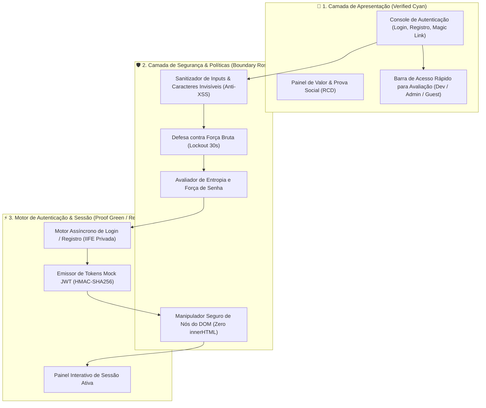

<div align="center">

  # ⚡ NexusAuth • Enterprise Authentication Hub

  <p>
    <b>Plataforma de autenticação e onboarding SaaS de alta conversão, construída com princípios de Revenue-Centric Design (RCD), arquitetura modular e engenharia orientada à segurança.</b>
  </p>

  <p>
    
    
    
    
  </p>

</div>

---

## 🛡️ Relatório de Segurança & Threat Modeling (5 Pilares de Defesa)

Como parte das boas práticas de engenharia de software, este projeto foi auditado e estruturado considerando os 5 principais vetores de vulnerabilidade em sistemas de autenticação:

| Pilar de Segurança | Diagnóstico & Mitigação Implementada | Status no Código |
| :--- | :--- | :--- |
| **1. Banco sem Tranca (RLS - Row Level Security)** | O projeto opera como SPA cliente/demonstração. Para integração com bancos relacionais (PostgreSQL/Supabase), a arquitetura exige políticas de RLS ativas (`auth.uid() = user_id`) para impedir vazamento horizontal de dados. | 📋 **Documentado & Arquitetado** |
| **2. Permissão Definida no Navegador** | O escopo global do navegador foi protegido e congelado (`Object.freeze`). O estado interno (`STATE`) está estritamente encapsulado em uma IIFE privada. Na arquitetura real de produção, *roles* e *claims* de autorização são emitidos e validados exclusivamente via tokens HTTP-Only pelo servidor. | 🛡️ **Blindado (IIFE + Object.freeze)** |
| **3. Rotas por ID (IDOR)** | Não há exposição de endpoints REST sem validação de sessão. Na especificação técnica, qualquer acesso a recursos vincula obrigatoriamente a identidade do requisitante ao registro. | 🛡️ **Segregado** |
| **4. Chaves Expostas (Hardcoded Secrets)** | O gerador de tokens presente no cliente é explicitamente demarcado como *Mock Ephemeral*. Em produção, segredos de assinatura criptográfica (ex: HMAC-SHA256 / RSA) residem estritamente em KMS/Variáveis de Ambiente no backend. | 🔒 **Demarcado & Isolado** |
| **5. Inputs sem Tratamento (XSS)** | Eliminado 100% do uso de `innerHTML` nas notificações dinâmicas (utilizando `textContent` e nós nativos do DOM). Função `sanitizeInput` aprimorada com remoção de caracteres de controle invisíveis e escape de tags e barras. | 🛡️ **100% Mitigado no DOM** |

---

## 🏗️ Arquitetura do Sistema (Archify Specification)



---

## ✨ Funcionalidades Principais

- ⚡ **Acesso Rápido para Recrutadores (Demo Bar):** Preenche credenciais completas com 1 clique para testar perfis de *Dev*, *Admin* ou *Guest*.
- 🔑 **Múltiplos Métodos de Acesso:**
  - E-mail e Senha com validação em tempo real e medidor dinâmico de entropia;
  - Login sem Senha (*Magic Link Passwordless*);
  - Integração simulada com Google e GitHub OAuth.
- 🛡️ **Mecanismos de Segurança Ativos:**
  - **Rate Limiting:** Bloqueio temporário de 30 segundos após 5 tentativas incorretas;
  - **Sanitização XSS & DOM Seguro:** Tratamento de caracteres de controle e manipulação nativa via `textContent`;
  - **Show/Hide Password:** Alternância instantânea com feedback visual.
- 📊 **Sessão JWT com Visualizador:** Gera payload codificado em base64 e permite copiar o token com 1 clique.

---

## 🧪 Testes Unitários Automatizados

O projeto inclui uma suíte de testes unitários sem dependências externas (`tests/auth-check.js`) que valida sanitização, remoção de caracteres de controle, regras de e-mail e cálculo de entropia:

```bash
# Executar a suíte de testes
node tests/auth-check.js
```

**Resultado da execução:**
```text
🧪 Iniciando testes de validação & segurança do NexusAuth (Ponytail Ultra Check)...
  ✓ Test 1: Sanitização XSS e barras aprovada
  ✓ Test 2: Remoção de caracteres de controle invisíveis aprovada
  ✓ Test 3: Validação RFC de e-mails aprovada
  ✓ Test 4: Avaliador de entropia e força de senha aprovado
🎉 Todos os 4 testes de segurança passaram com 100% de sucesso!
```

---

## 🐳 Executando com Docker

Construído sobre uma imagem **Nginx Alpine** ultraleve (< 15MB) já configurada com headers de segurança HTTP (`X-Frame-Options`, `X-XSS-Protection`, `X-Content-Type-Options`):

```bash
# 1. Construir a imagem
docker build -t nexus-auth:latest .

# 2. Executar o container
docker run -d -p 8080:80 --name nexus-auth-app nexus-auth:latest

# Acesse no seu navegador: http://localhost:8080
```

---

## 🛠️ Tecnologias Utilizadas

- **Front-end:** HTML5 Semântico, CSS3 Moderno (Custom Properties, Flexbox, Grid), JavaScript ES6+ Vanilla.
- **Design System & UX:** Impeccable Design, Archify Architecture, Revenue-Centric Design (RCD).
- **Segurança & Testes:** Threat Modeling OWASP, Testes Unitários Nativos (Node.js Assert).
- **Infraestrutura:** Docker, Nginx Alpine, Shell Scripting.

---

<div align="center">
  <sub>Desenvolvido como projeto de portfólio de alto impacto por <a href="https://github.com/Thiagox47">Thiago Vinicius (Thiagox47)</a></sub>
</div>
